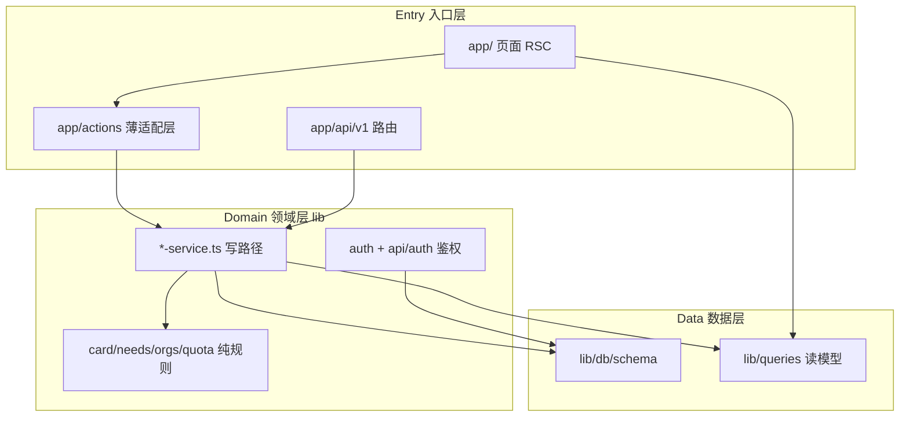

# We Match 重构蓝图（REFACTOR）

- 版本：v1.1
- 日期：2026-08-13
- 状态：Phase 0–4 全部完成。留作分层约定的说明书，动手前先读

> **这份文档不是 PRD/DESIGN/QUOTA 的重复。** 产品目标以那三份为准；本文只回答一件事：**当前代码离目标形态差多少，按什么顺序补齐**。动手改代码前先读本文与 [PRD.md](PRD.md) 文首那段警告，别把目标形态当成线上形态。

---

## 1. 现状速写

| 维度 | 现状 |
|------|------|
| 产品进度 | M1–M6 已落地（连接制 + `lib/quota.ts`）；QUOTA P0–P4 全套上线，含额度 UI、赚回与惩罚阶梯（P4 默认 `shadow`，只观测不降额）；独立「我的连接」中心 `/me/connections` 收口收到/发起两侧管理 |
| 数据一致性 | 举手接受 + 双向揭示、需求删除、组织解散均在 SQLite `IMMEDIATE` 事务内原子完成；接受/拒绝用 `status='pending'` 条件更新防并发双处理；组织解散按 `contact_reveals → connections → needs → members → join_requests → org` 外键顺序清理子图 |
| 技术栈 | Next.js 16 App Router + React 19 + SQLite/better-sqlite3 + Drizzle + Tailwind 4；自研 auth 与 i18n；单实例自部署，不适配 Vercel serverless |
| 代码规模 | 写路径全部在 `lib/*-service.ts`（card / needs / api-keys / connections / orgs / safety）；`app/actions` 为薄适配层 |
| 测试 | Vitest：可见性、举手状态机、并发举手/双接受/双确认/揭示原子性、删除与解散的审计保留、连接中心查询（隔离/置顶/stale）、额度（含赚回、降额与 shadow/enforce 双模式）、举报与拉黑、组织、续期锁、广场排序、API 硬化、固定码 |
| CI | [`.github/workflows/ci.yml`](../.github/workflows/ci.yml)：`check`（`pnpm lint` + `pnpm test` + `pnpm build`）+ 门禁后的 `deploy`（`make deploy` 含备份，部署后打 `/api/health` smoke check） |

**核心张力已随 M6 解除**：联系方式默认 `connected`，接受后写入 `contact_reveals`，发布/举手/接受走 `lib/quota.ts`。关键写路径已收敛到原子事务，连接管理有了独立闭环页。文档与代码此刻没有已知缺口——下一次动土前先更新本表，别让它变成考古材料。

---

## 2. 诊断：当初为什么要重构

按严重度排列，每条都对应具体路径。前四条已消解，留在这里是为了说明分层约定是怎么来的。

| # | 问题 | 现状 |
|---|------|------|
| 1 | **PRD/代码双轨** | 已消解。联系方式默认 `connected`，[`lib/quota.ts`](../lib/quota.ts) 与 `contact_reveals` 落地，QUOTA P3/P4 也已实现 |
| 2 | **领域层未抽完** | 已消解。safety 写逻辑进了 [`lib/safety-service.ts`](../lib/safety-service.ts)，Action 只转发 |
| 3 | **命名双文件易混** | 已消解。约定写在 [`lib/card.ts`](../lib/card.ts) / [`lib/needs.ts`](../lib/needs.ts) / [`lib/queries.ts`](../lib/queries.ts) 文件头：`lib/X.ts` = 常量 + 纯函数，`lib/X-service.ts` = 有 IO 的写路径 |
| 4 | **读模型仍散** | 已消解。需求详情的举手查询、「我的」页的组织计数与举手列表都进了 [`lib/queries.ts`](../lib/queries.ts) |
| 5 | **运维小债** | 已消解。[`lib/brand.ts`](../lib/brand.ts) 的 `OPERATOR_NAME` / `OPERATOR_CONTACT` 已填成真实信息 |

---

## 3. 目标架构

重构后应稳定收敛到下面这张分层图。它固化「谁能调谁」，不是新增框架。

**四条硬规则（重构目标，写死）：**

1. **写路径只进 service**：校验、额度、通知副作用、落库都在 `lib/*-service.ts`。Action 和 API Route 只做 FormData/JSON 适配 + 鉴权入口，不直接拼写库逻辑。
2. **读路径优先 `lib/queries`**：列表/详情从 [`lib/queries.ts`](../lib/queries.ts)（或按域拆出的 `*-queries`）取，页面不内联复杂 Drizzle。
3. **可见性单一真相**：`canSee` / 名片序列化统一走 [`lib/card.ts`](../lib/card.ts)，RSC 与 `/api/v1` 共用同一套过滤；M6 时只在这一处扩展 `connected`。
4. **不引入新框架**：保持 SQLite 单机、不拆微服务、不加 ORM 之外的仓储抽象、不换 auth/i18n 方案。

---

## 4. 分阶段路线

每个阶段都有退出条件；**顺序不可乱**——尤其 Phase 1 必须在 Phase 3（M6）之前。

### Phase 0 — 文档与护栏（0.5–1 天，纯低风险）

- 在本文补一张「线上形态 vs 目标形态」对照表（见 [§5](#5-线上形态-vs-目标形态对照)），任何人动 M6 前先看。
- CI 接入 `pnpm test`（改 [`.github/workflows/ci.yml`](../.github/workflows/ci.yml)），让后续重构有回归信号。
- 修正 README 的 Node 版本，与 `engines: 22.x` 一致。

退出条件：CI 里能看到 test 结果；文档对照表就位。

### Phase 1 — 抽薄 Actions（纯重构，行为不变）

按行数与 API 缺口定优先级：

1. **orgs**：从 [`app/actions/orgs.ts`](../app/actions/orgs.ts) 抽出 `lib/orgs-service.ts`——创建、邀请码/广场申请、审批、任命 admin、移除成员。Action 只保留 FormData 解析 + `getSessionUser` + i18n 文案。
2. **connections**：从 [`app/actions/connections.ts`](../app/actions/connections.ts) 抽出 `lib/connections-service.ts`——举手/接受/拒绝/撤回/完成的状态机。这是 M6 与「API 补举手写操作」的共同地基。
3. **safety / 通知副作用**：举报、拉黑、内容隐藏能共用的进 service（可并入相关域或单独 `safety-service`），Action 只转发。

退出条件：所有页面行为与重构前一致；org 审批流与举手状态迁移各有单元测试兜底。

### Phase 2 — 统一读模型与序列化（已完成）

- 页面内联的复杂查询收进 [`lib/queries.ts`](../lib/queries.ts)：`getNeedConnections`、`getOrgOverviewStats`、`getMyPendingJoinRequests`、`getIncomingPendingHands`。
- API 序列化 [`lib/api/serialize.ts`](../lib/api/serialize.ts) 与名片投影 `projectCard`（[`lib/card.ts`](../lib/card.ts)）共用同一套可见性过滤。
- 命名约定写进文件头注释：`lib/X.ts` = 常量 + 纯函数/校验，`lib/X-service.ts` = 有 IO 的写路径。

### Phase 3 — M6 产品落地（已完成）

严格按 [`docs/QUOTA.md`](QUOTA.md) 的 P1→P2 依赖顺序，均已落地：

1. **schema**：`FieldVisibility` 增加 `connected` 档；新增 `contact_reveals` 表；收紧迁移 `drizzle/0009_m6-connection.sql`。
2. **可见性**：`canSee` 支持 `connected`；历史 `public` 按 `connected` 解释，用户主动写入的 `authenticated` 保留。
3. **举手交换**：举手表单加联系方式选择器；接受时各写一条 `contact_reveals`。
4. **额度**：`lib/quota.ts` 挂到发布 / 举手 / 接受；发布走网页与 `/api/v1` 同一 `createNeed`。举手/接受仅网页（开放 API 不提供写端点）。
5. **详情页收尾**：去掉「未连接也可以直接联系」。

退出条件已对齐 [PRD.md](PRD.md) §9 M6 行。

### Phase 4 — 质量与运维收尾（已完成，剩一条）

- 可见性矩阵、续期锁、额度边界测试都在（`tests/visibility.test.ts`、`tests/renewal-lock.test.ts`、`tests/quota.test.ts`、`tests/safety.test.ts`）。
- Agent API 决策已定：**举手仅网页**。理由与措辞见 [api.md](../skills/we-match/references/api.md)「v1 不提供」——「决定和某个人发生关系」的动作永远由人拍板，不是还没做。
- [`lib/brand.ts`](../lib/brand.ts) 的运营者名称与联系邮箱已填，`/terms` 与 `/privacy` 不再显示占位符。README 上线前清单里这一条只剩「文案经过人工确认」。

### Phase 5 — QUOTA P3/P4 收尾（已完成）

- 额度 UI：「我的 → 额度」分类（[`components/quota-panel.tsx`](../components/quota-panel.tsx)）、发布表单剩余 ≤ 3 提示、举手表单常驻计数、未处理举手 ≥ 5 时「我的」页顶部提示。
- 赚回与惩罚阶梯：`effectiveDailyLimit`，惩罚优先于赚回。
- 「已无回应」：pending 挂满 72 小时后 `isStalePending` 改写徽章文案，额度此前已经释放。
- 举报 / 拉黑 / 建组织 / 加入组织补上 L1 + L2：这四项 QUOTA 表里一直写着，之前只有文档没有代码。

---

## 5. 线上形态 vs 目标形态（对照）

**此刻没有已知差距。** 本节原本用来提醒「文档写的不是线上跑的」，M6 与 QUOTA P0–P4 落地后两者对齐了。

下次再引入「文档先于代码」的设计时，把差项重新列回这张表——它的价值在于承认差距，不在于永远是空的。

---

## 6. 明确不做

- 不迁 Postgres、不上 Vercel serverless（单文件 SQLite 是刻意选择）。
- 不引入密码登录、站内私信、自动撮合（PRD MVP 范围外）。
- 不重写 i18n：`lib/i18n/dict/*` 大字典可后续拆，但不进本轮主线。
- 不把 DESIGN 视觉令牌当作本次重构范围——视觉规范单独走 [DESIGN.md](DESIGN.md)。

---

## 7. 成功标准（已达成）

- 新人读完本文 + [PRD.md](PRD.md) 文首，不会把目标形态当线上形态。
- 每个写操作有唯一 service 入口；`app/actions/*.ts` 都是薄适配层。
- CI 含 `pnpm test`；可见性、额度、举报与拉黑都有回归用例。
- M6 验收逐条对齐 [PRD.md](PRD.md) §9 表格里 M6 那一行。

---

## 附：关键文件索引

- 产品口径：[docs/PRD.md](PRD.md) §9、[docs/QUOTA.md](QUOTA.md)
- 分层样板：[lib/card-service.ts](../lib/card-service.ts)、[lib/needs-service.ts](../lib/needs-service.ts)、[lib/connections-service.ts](../lib/connections-service.ts)、[lib/orgs-service.ts](../lib/orgs-service.ts)、[lib/safety-service.ts](../lib/safety-service.ts)
- 读模型：[lib/queries.ts](../lib/queries.ts)
- 可见性与额度真相：[lib/card.ts](../lib/card.ts)、[lib/quota.ts](../lib/quota.ts)、[lib/db/schema.ts](../lib/db/schema.ts)
